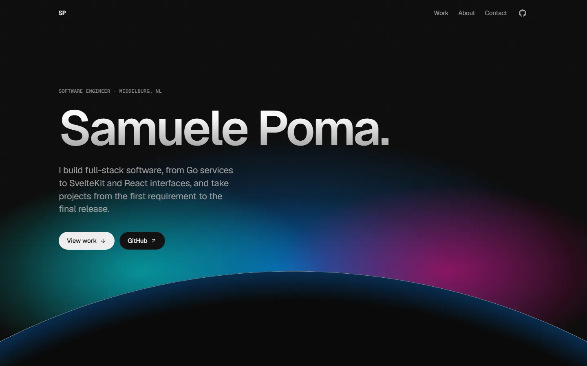
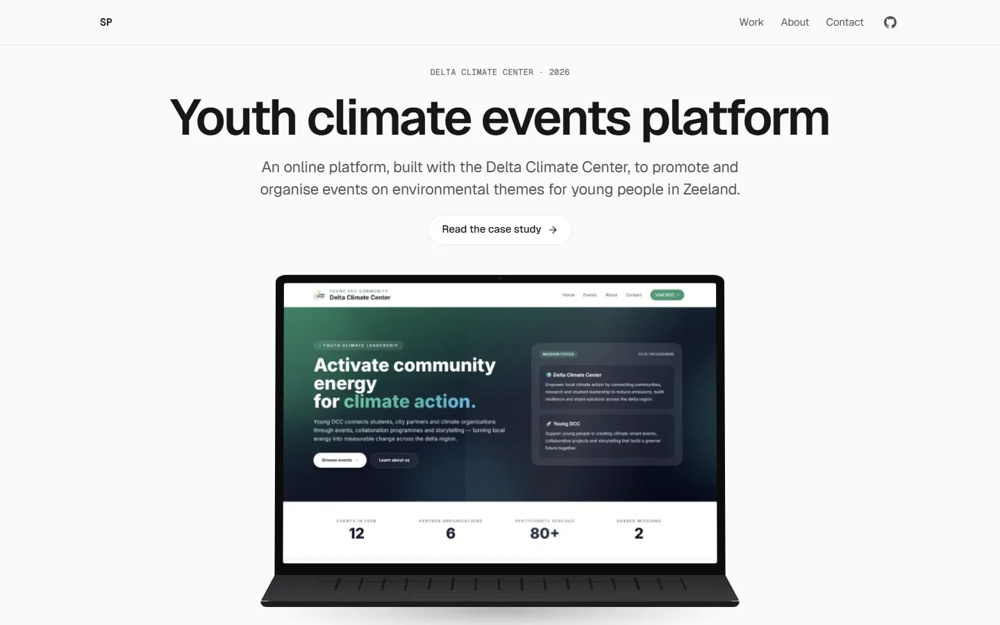
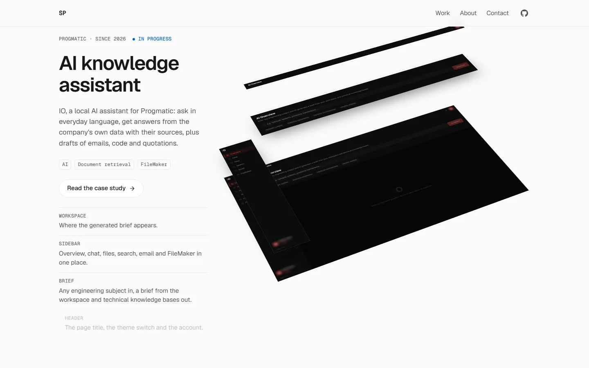
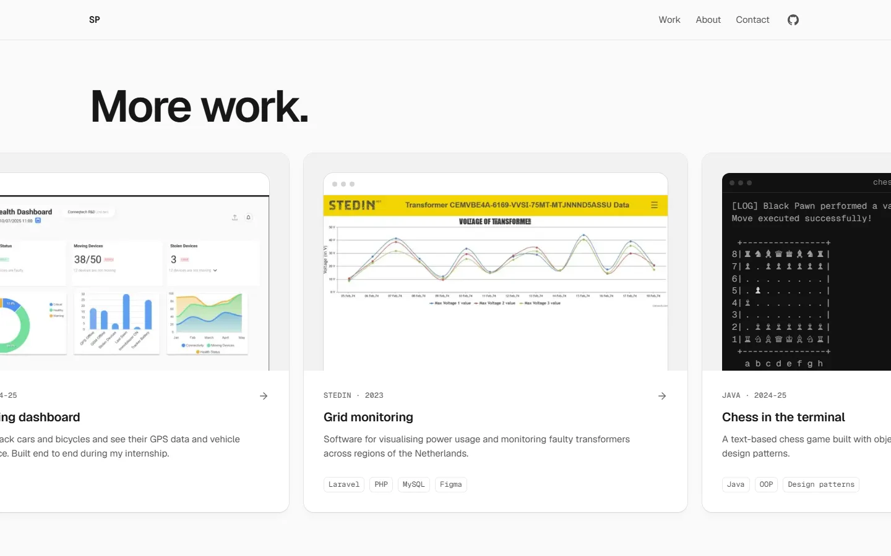

# samuelepoma.com

The portfolio of **Samuele Poma**, a software engineer in Middelburg, the Netherlands. It presents nine projects the way Apple presents a product: pinned, scroll-driven scenes in which a laptop opens on the live platform, two phones turn to face you, and an AI assistant's interface comes apart into its layers. Every project then has its own case study.



## Highlights

- **Static and fast.** Every page is prerendered; there is no server code, no database and no secret. First-load JavaScript is checked against a budget on every pull request, and Lighthouse on mobile scores 92 to 94 for performance and 100 for accessibility, best practices and SEO.
- **A scroll engine of its own.** The scenes run on [`src/lib/motion/`](src/lib/motion/): exactly solved springs, interpolated tracks and one read/update/render frame loop that writes styles straight to the page without re-rendering React. It replaced a 40 KB animation library ([ADR 0004](docs/adr/0004-performance-budgets.md)).
- **Accessible.** WCAG 2.2 AA checked with axe on every route in five browsers, a keyboard walkthrough test, visible focus everywhere, and a full experience with reduced motion or without JavaScript.
- **Secure by default.** A Content-Security-Policy with no `'unsafe-inline'` for scripts, built by hashing each page's inline scripts after the build ([ADR 0003](docs/adr/0003-csp-strategy.md)), plus HSTS and the other security headers.
- **Private.** No cookies and no banner: analytics are cookieless and aggregate ([ADR 0005](docs/adr/0005-cookieless-analytics.md)).
- **Content as data.** Projects, images, skills and the legal pages are typed objects validated by schemas, so a missing fact means a shorter page, never a guessed one.

|                                                                                            |                                                                                                 |
| ------------------------------------------------------------------------------------------ | ----------------------------------------------------------------------------------------------- |
|                      |  |
|  |                         |

## Tech stack

| Area      | Tools                                                                                                        |
| --------- | ------------------------------------------------------------------------------------------------------------ |
| Framework | [Next.js 16](https://nextjs.org) (App Router, static generation), React 19                                   |
| Language  | TypeScript, strict (`noUncheckedIndexedAccess`, `exactOptionalPropertyTypes`)                                |
| Styling   | Tailwind CSS v4 with design tokens, Geist and Geist Mono (self-hosted Latin subsets)                         |
| Motion    | The in-house scroll engine, CSS scroll-driven animations, Lenis for wheel smoothing on desktop               |
| Content   | Typed modules validated with Zod                                                                             |
| Testing   | Vitest, Testing Library, Playwright (Chromium, Firefox, WebKit, Pixel 7, iPhone 15), axe-core                |
| Quality   | ESLint (typescript-eslint strict, jsx-a11y strict), Prettier, knip, html-validate, Lighthouse CI, linkinator |
| CI/CD     | GitHub Actions, Vercel                                                                                       |

## Getting started

**Requirements:** Node.js 24 (see `.nvmrc`) and pnpm 12. Works the same on Windows, macOS and Linux.

```bash
pnpm install
cp .env.example .env.local   # Windows PowerShell: Copy-Item .env.example .env.local
pnpm dev                     # http://localhost:3000
```

The site needs no secrets: the only variables are the public site URL and an optional analytics id, both described in [`.env.example`](.env.example). Before the first end-to-end run, install the browsers with `pnpm exec playwright install`.

## Scripts

| Script                              | Description                                                      |
| ----------------------------------- | ---------------------------------------------------------------- |
| `pnpm dev`                          | Start the development server                                     |
| `pnpm build` / `pnpm start`         | Create the production build (and its CSP) / serve it             |
| `pnpm check`                        | Lint, types, unused code, formatting and unit tests in one go    |
| `pnpm lint` / `pnpm lint:fix`       | Lint (zero warnings allowed) / autofix                           |
| `pnpm typecheck`                    | Type-check the project                                           |
| `pnpm knip`                         | Find unused files, exports and dependencies                      |
| `pnpm format` / `pnpm format:check` | Format with Prettier / check formatting                          |
| `pnpm test` / `pnpm test:coverage`  | Unit and component tests / with coverage (≥ 90% on `src/lib`)    |
| `pnpm test:e2e`                     | End-to-end tests (Chromium, Firefox, WebKit, Pixel 7, iPhone 15) |
| `pnpm validate:html`                | Validate every prerendered page (after `pnpm build`)             |
| `pnpm size`                         | First-load JavaScript per page, against its budget               |
| `pnpm lighthouse`                   | Lighthouse CI with the budgets in `lighthouserc.json`            |
| `pnpm links`                        | Check every link on a running server (`pnpm start`)              |
| `pnpm fonts` / `pnpm icons`         | Regenerate the font subsets / the icons (output is committed)    |
| `pnpm licenses:write`               | Regenerate `THIRD_PARTY_LICENSES.md`                             |

## Quality gates

Every pull request runs four jobs, and `main` only changes through squash-merged pull requests with all four green:

1. **Quality:** lint, types, unused code, formatting, unit tests with coverage.
2. **Security:** dependency audit, licence check, secret scan over the whole history (gitleaks).
3. **End to end:** the production build tested in five browsers, including accessibility, metadata, security headers, reduced motion and no JavaScript.
4. **Audit:** valid HTML on every page, the JavaScript budget, Lighthouse budgets and a link check.

## Project structure

```
src/
  app/          Routes, metadata files, error boundaries
  components/   home, work, legal, layout, ui, motion, scenes, visuals, seo
  content/      Typed site content and its schemas
  fonts/        Latin subsets of Geist and Geist Mono
  lib/          Pure logic: env, SEO, security headers, the scroll engine, formatting
scripts/        Post-build CSP, checks, licences, fonts and icons
tests/          unit/ and e2e/
docs/           Architecture, decision records, screenshots
```

## Documentation

- [docs/ARCHITECTURE.md](docs/ARCHITECTURE.md): how content becomes pages, the build, motion, security and tests
- [docs/adr/](docs/adr/): the decisions behind them, one record each
- [DESIGN.md](DESIGN.md): the design system (colour, type, motion, components)
- [SECURITY.md](SECURITY.md): how to report a security problem

## Workflow

Work happens on `feat/*`, `fix/*`, `chore/*` or `docs/*` branches and lands through pull requests. Commit messages follow [Conventional Commits](https://www.conventionalcommits.org), enforced by a commit hook; lint, formatting and types run on every commit.

## Licence

The source code is released under the [MIT License](LICENSE). The site's content (text, images, résumé, name and monogram) is **not** covered by it; all rights are reserved. Third-party licences are listed in [THIRD_PARTY_LICENSES.md](THIRD_PARTY_LICENSES.md).
