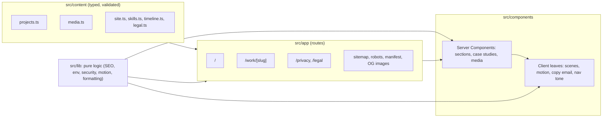
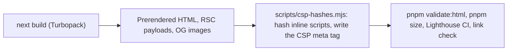
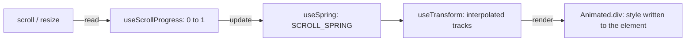

# Architecture

A static site: every page is rendered at build time and served as HTML from the CDN. There is no server code at runtime, no database and no secret. This page explains how the pieces fit; the reasons behind the main choices are in [the ADRs](adr/).

## From content to page



- **Content is data.** Projects, images, skills, the timeline and the legal pages are typed objects in `src/content/`, checked by Zod schemas in the unit tests. Pages never hard-code copy.
- **Routes are thin.** A route reads content, builds its metadata and JSON-LD with `src/lib/seo/`, and composes components. `/work/[slug]` is generated for every project with `generateStaticParams`; an unknown slug is a 404.
- **Server Components by default.** Only small interactive leaves are client components: the scroll scenes and motion pieces, the nav's colour switch, the copy-email button, smooth scrolling and analytics.

## Build



`pnpm build` runs `next build`, then hashes the inline scripts of every page into its Content-Security-Policy ([ADR 0003](adr/0003-csp-strategy.md)). In CI the output is then validated, measured against the JavaScript budget, audited with Lighthouse and crawled for broken links ([ADR 0004](adr/0004-performance-budgets.md)).

## Motion

The home page tells its story through pinned scenes: a section several screens tall whose stage sticks to the viewport while scrolling drives the animation (DESIGN.md §7).



- `src/lib/motion/` is a small engine of pure functions: motion values, interpolation, springs solved exactly, scroll offsets, transform shorthands and one shared animation-frame loop that reads layout, then updates values, then writes styles.
- `src/components/motion/` binds it to React. Values change outside React, so a scene moves on every frame without re-rendering.
- The server renders every scene at its starting values; without JavaScript, or with reduced motion, every piece is shown in its final state and nothing is pinned.
- One-off reveals (a chart wiping in, lines drawing themselves, text lighting up) are CSS transitions and scroll-driven animations. Mouse-wheel scrolling is smoothed by Lenis on desktop only ([ADR 0007](adr/0007-smooth-scrolling.md)).

## Security and privacy

- **Headers** on every route (`next.config.ts`, built in `src/lib/security/headers.ts`): a Content-Security-Policy without `'unsafe-inline'` for scripts, HSTS, `nosniff`, `Referrer-Policy`, `Permissions-Policy`, `X-Frame-Options`, COOP and CORP. Builds outside production also send `X-Robots-Tag: noindex`.
- **Environment** variables are read only through `src/lib/env/`, validated with Zod. Both are public: the site URL and an optional analytics id.
- **No cookies.** Analytics are cookieless and aggregate, so there is no consent banner ([ADR 0005](adr/0005-cookieless-analytics.md)).
- Contact is an email address with a copy button: no form, so no input from strangers reaches the site.

## Tests and CI

| Layer         | Tool                       | What it covers                                                                          |
| ------------- | -------------------------- | --------------------------------------------------------------------------------------- |
| Unit          | Vitest                     | Content schemas, SEO builders, security headers, env, formatting, the motion engine     |
| Component     | Vitest, Testing Library    | Buttons, media slots, project cards, the copy-email button                              |
| End to end    | Playwright, 5 browsers     | Navigation, metadata, security headers and CSP, motion, reduced motion, no-JS, keyboard |
| Accessibility | axe-core in Playwright     | Every route on desktop and mobile, WCAG 2.2 AA                                          |
| Build output  | html-validate, linkinator  | Valid HTML on every page, no broken links                                               |
| Performance   | `pnpm size`, Lighthouse CI | First-load JavaScript per page and Lighthouse budgets on mobile                         |

GitHub Actions runs four jobs on every pull request: quality (lint, types, unused code with knip, formatting, unit tests with coverage of at least 90% on `src/lib`), security (dependency audit, licence check, gitleaks), end-to-end tests, and the audit of the build output. `main` only changes through squash-merged pull requests with all four green.

## Folders

```
src/
  app/          Routes, metadata files, error boundaries
  components/   home, work, legal, layout, ui, motion, scenes, visuals, seo
  content/      Typed site content and its schemas
  fonts/        Latin subsets of Geist and Geist Mono
  lib/          Pure logic: env, SEO, security, motion, formatting
scripts/        Post-build CSP, checks, licences, fonts and icons
tests/          unit/ and e2e/
docs/           This page, the ADRs and the README screenshots
```
